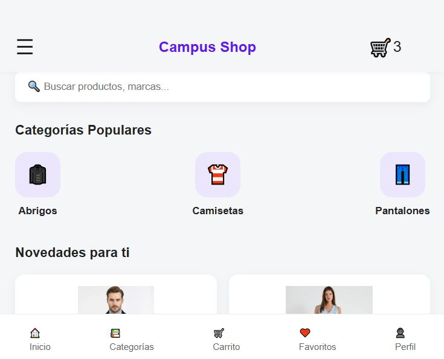
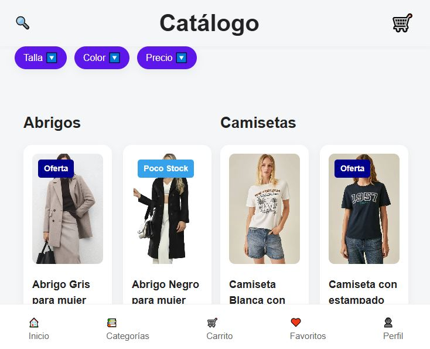
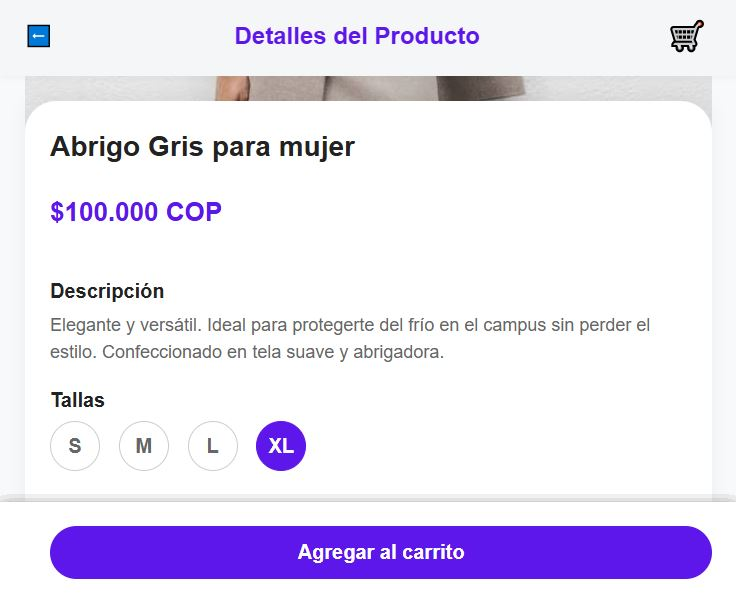
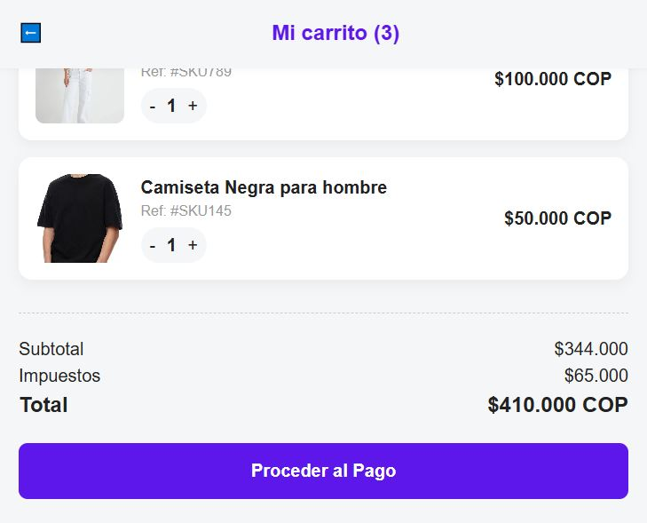
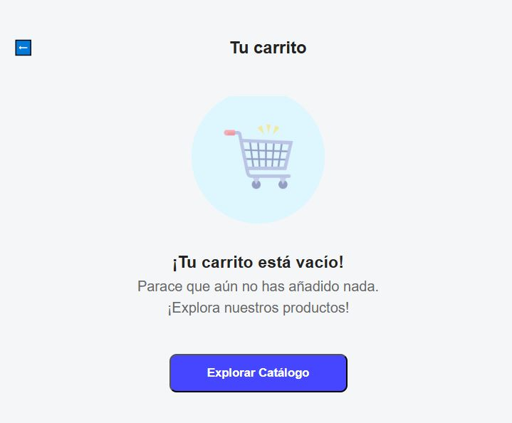
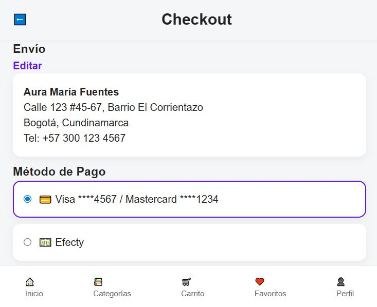
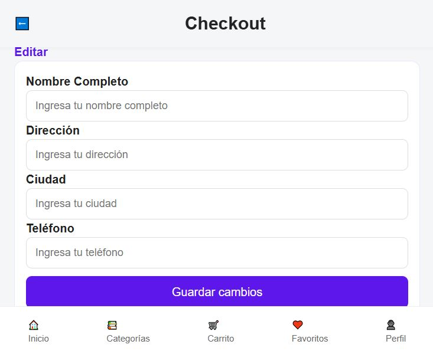
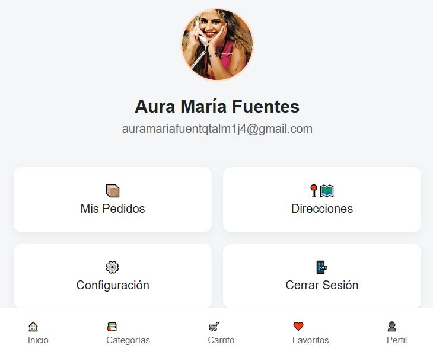

# Proyecto Campus Shop HTML-CSS

## Natalia Rolón Leal

### Descripción del proyecto
Campus Shop es una aplicación web de comercio electrónico (E-commerce) diseñada con un enfoque "Mobile First". Su objetivo es ofrecer una experiencia de compra fluida y moderna para estudiantes y personal universitario, permitiéndoles explorar un catálogo de prendas de vestir, ver detalles específicos y gestionar un carrito de compras desde sus dispositivos móviles.

### Planteamiento del problema
Los usuarios de la comunidad campus a menudo carecen de una plataforma centralizada y optimizada para móviles donde puedan adquirir productos de moda o estilo casual de forma rápida. Las interfaces web tradicionales suelen ser pesadas y difíciles de navegar en pantallas pequeñas, lo que genera una alta tasa de abandono en el proceso de compra.

### Objetivo del sistema
Desarrollar una interfaz web intuitiva, ligera y altamente responsiva que emule la experiencia de una aplicación móvil nativa. El sistema busca facilitar la visualización de productos, la selección de tallas y la simulación de un proceso de compra (checkout) de manera organizada y estética.

### Solución propuesta
Se implementó una estructura basada en HTML5 y CSS organizada correctamente. La solución utiliza un diseño de navegación por pestañas inferiores (bottom navigation) y un menú lateral (sidebar) para maximizar el área de contenido. Se priorizó la limpieza visual y el uso de variables CSS para mantener la consistencia en toda la plataforma.

### Funcionalidades implementadas
- **Catálogo Detallado:** Visualización de productos con imágenes, precios y etiquetas de estado (como "Poco Stock" u "Oferta").

- **Detalle de Producto:** Página específica con selector de tallas interactivo y descripciones ampliadas.

- **Gestión de Carrito:** Interfaz para revisar productos seleccionados, ajustar cantidades y calcular totales.

- **Sistema de Checkout:** Formulario organizado para la gestión de envíos y confirmación de pago.

- **Historial de Pedidos:** Sección de perfil para rastrear compras previas con estados (Entregado, En camino, Cancelado).

- **Menú Lateral Interactivo:** Acceso rápido a las diferentes secciones de la aplicación sin recargar la página principal.

### Tecnologías implementadas
- **HTML5:** Para la estructura semántica de todas las vistas.

- **CSS:**
- base.css: Estilos globales y variables.
- layout.css: Estructura y navegación.
- components.css: Estilos de botones, tarjetas y elementos reutilizables.
- responsive.css: Adaptación para tablets y pantallas de escritorio.

### Instrucciones de instalación y ejecución
1. **Clona el repositorio:** git clone https://github.com/nataliarolonleal29/Proyecto_Campus_Shop_Natalia_Rolon_leal.git

2. **Extensión:** Asegúrate de tener instalada la extensión "Live Server"

3. **Ejecutar la aplicación:** Ya teniendo VS Code abierto y el repositorio clonado, da click en el botón "Go live".

### Uso de la aplicación
**Página de Inicio:** Al entrar, verás los productos destacados. Puedes usar el ícono de la esquina superior izquierda (☰) para abrir el menú lateral e ir hacia las diferentes páginas.

**Explorar:** Haz clic en "Catálogo" en la barra inferior para ver todos los productos.

**Detalles:** Haz clic en cualquier producto, donde dice "Ver más" para ir a la página de detalles, donde podrás leer las descripciones de cada producto y elegir tu talla.

**Compra:** Desde el catálogo o el detalle, hay un botón para añadir productos al carrito. Ve a la pestaña del carrito en index (🛒) para ver tu resumen.

**Carrito:** Para ver el carrito vacío, da click en la barra inferior, en dónde dice Carrito🛒.

**Checkout:** Dentro del carrito, haz clic en "Proceder al Pago" para ir a la pantalla de envío y finalizar el proceso simulado. Allí puedes poner tus propios datos personales o dejar los del usuario predeterminado.

**Perfil:** En la pestaña de perfil, puedes acceder al "Historial de Pedidos" para ver tus compras pasadas.

### Estructura de Archivos
Es importante mantener este orden para que la aplicación cargue correctamente:
/
├── index.html
├── catalogo.html
├── producto.html
├── carrito.html
├── checkout.html
├── vacio.html
├── css/
│   ├── base.css
│   ├── layout.css
│   ├── components.css
│   └── responsive.css
└── images/

### Reflexión Final
Este proyecto demuestra cómo una organización sólida del código CSS y una estructura HTML bien planeada pueden crear una experiencia de usuario de alta calidad. El mayor aprendizaje fue el manejo de Flexbox para resolver problemas de alineación y la importancia de separar los estilos en módulos (Base, Layout, Components) para escalar el diseño de manera eficiente. Campus Shop es ahora una base sólida para integrar en el futuro un sistema de Back-end real.
El mayor desafío del proyecto fue estructurar una navegación compleja y elementos interactivos, como el menú lateral y los selectores de tallas, utilizando únicamente CSS puro, además de gestionar la superposición de capas para mantener un diseño limpio. Este proceso permitió consolidar aprendizajes clave en el uso avanzado de Flexbox y Grid, la importancia de la metodología Mobile-First para garantizar la responsividad y el valor de una arquitectura de archivos modular para facilitar el mantenimiento profesional del código.
